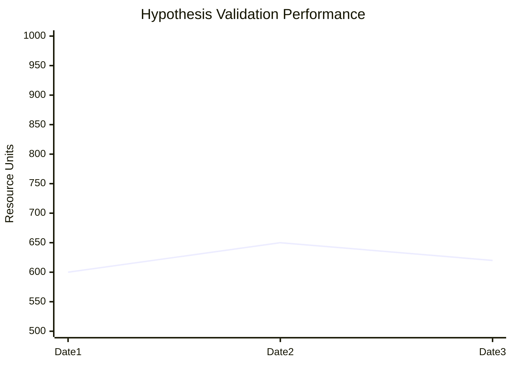

# 🔬 APEXVIPER SYSTEM ARCHITECTURE v1.0

**Project:** High-Frequency Hypothesis Validation  
**Protocol:** Multi-Agent GitHub Integration  
**Status:** ACTIVE

---

## 1. TERMINOLOGY PROTOCOLS
To maintain objective analysis, all Agents must strictly adhere to this lexicon:
- **Betting** → "Hypothesis Validation"  
- **Bankroll** → "Resource Allocation Units (RAU)"  
- **Wager** → "Unit Allocation"  
- **Win/Loss** → "Successful/Failed Validation"  
- **Odds** → "Implied Probability"

---

## 2. THE AGENT WORKFLOW (The "Hands")
**Distinction between Chat and Agents:**

### A. Copilot Chat (`@workspace`)
- **Role:** The Consultant (Analysis & Strategy)
- **Permissions:** READ-ONLY
- **Usage:** "Analyze this file," "Suggest a strategy."
- **Cannot:** Create or edit files directly.

### B. Copilot Agents (The "Doers")
- **Role:** The Maintenance Crew (Execution)
- **Permissions:** READ & WRITE
- **Usage:** Triggered via GitHub Issues or explicit "Agent Mode" commands.
- **Can:** Create files, edit code, open Pull Requests.

**The "Agent Mode" Hack:**
To automate Daily Logs without writing code:
1. Create a GitHub Issue titled: `[TASK] Generate Daily Log`.
2. Tag `@copilot` in the body.
3. Command: "Read APEXVIPER_EMERGENCY_PLAYBOOK.md and generate today's log."

---

## 3. MULTI-MODEL PIPELINE (The "Brains")

### Phase 1: Ingestion (Gemini 2.5 Pro)
- **Task:** Raw data gathering.
- **Output:** Statistical tables (SOG, Concentration, Splits).
- **Storage:** `research/YYYY-MM-DD-data.md`

### Phase 2: Synthesis (Claude 3.5 Sonnet)
- **Task:** Decision logic & Strategy application.
- **Input:** Reads the Gemini data file.
- **Output:** Final Validation Plan (The "Bet Slip").
- **Storage:** `research/YYYY-MM-DD-synthesis.md`

---

## 4. TRACKING & VISUALIZATION
**Resource Allocation Ledger**
Tracking is done via Mermaid.js graphs in `TRACKING.md`.

